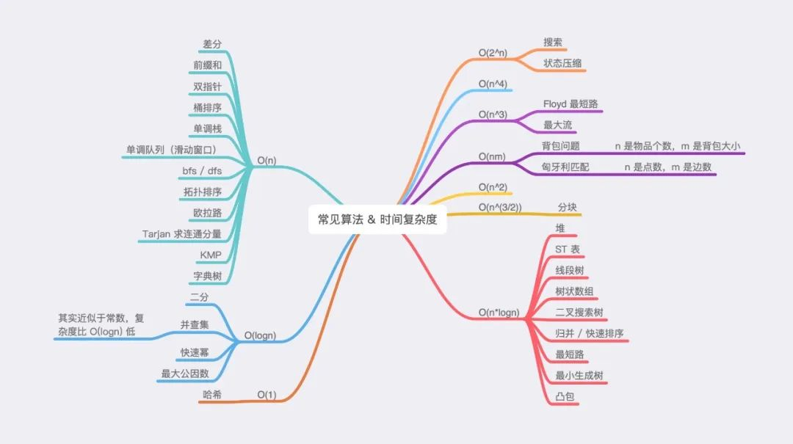

常见算法介绍
==

> 参考 https://zhuanlan.zhihu.com/p/143731475

### 1. 背景

偶然在知乎上看到算法的一些处理心得，此处准备将基础做一下实践，并加深一下印象。

##### 常见算法的时间复杂度总结如下：

### 2. 以下内容依次介绍各类算法

复杂度 O(1)

- 哈希

复杂度 O(n)

- [前缀和算法与差分算法](on/prefixSum.md)
- [双指针算法](on/towPointer.md)
- [桶排序](../Sort/sort.php)
    - 可以看这个文章 https://zhuanlan.zhihu.com/p/164992268
- [单调栈](on/monostoneStack.md)
    - 可以参考这个文章 https://zhuanlan.zhihu.com/p/273400551
    - 应用场景涉及的面比较复杂**待深入**
- 单调队列(滑动窗口)
    - 可以看这篇文章了解 https://zhuanlan.zhihu.com/p/107758641
- BFS/DFS
    - DFS（Depth First Search）深度优先搜索（使用到递归或者栈辅助）
    - BFS（Breadth First Search）广度优先搜索 （使用队列辅助）
    - 常见的有树的遍历或者图的遍历
- 拓扑排序
-
    - **待深入**
- 欧拉路
- Tarjan求连通分量
- KMP
- 字典树

复杂度 O(log(n))

- 二分
    - 最常用的，这里不多做解释了
- 并查集（近似于O(n), 比log(n)要低）
    - 可以可参考 https://zhuanlan.zhihu.com/p/93647900
    - 另外 需要注意路径压缩与按秩合并或者按大小合并
- 快速幂
    - https://zhuanlan.zhihu.com/p/95902286
    - 快速幂主要是基于二分的思路
    - 另外指数的运算可以将指数转换成二进制运算
- 最大公因数
   - 

复杂度 O(n*log(n))

- 堆
- ST表
- 线段树
- 树状数组
- 二叉搜索树
- 归并/快速排序
- 最段路
- 最小生成树
- 凸包

O(2^n)

- 搜索
- 状态压缩

O(n^3)

- Floyd最短路
- 最大流

O(n*m)

- 背包问题
- 匈牙利匹配

O(n^(3/2))

- 分块
