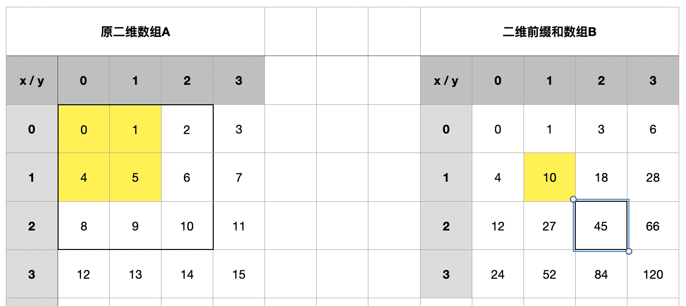

前缀和算法与差分算法
==

## 1. 前缀和

### 1.1 一维前缀和

有一个一维数组 X 和该数组的一维前缀和数组 Y ，则 X 和 Y 满足以下关系：

```
Y[0] = X[0], Y[1] = X[0]+X[1], Y[2] = X[0]+X[1]+X[2], ... Y[n]=X[1]+X[2]+...+X[n]
```

举个例子，如下的两个数组，Y是X的前缀和：

```
X = [1,2,3,4,5]
Y = [1,3,6,10,15]
```

Y中某个位置值的计算满足足下的公式

```
Y[n] = Y[n-1] + X[n]
```

### 1.2 二维前缀数组

有一个二维数组 A 和该数组的二维前缀和数组 B （其同样是个二维数组），则 A 和 B 满足以下关系：

```
B[0][0] = A[0][0], B[0][1] = A[0][0] + A[0][1], B[1][0] = A[0][0] + A[1][0], B[1][1] = A[0][0] + A[1][0] + A[0][1] + A[1][1] ...
```

参考下面的图片，我们可以发现如下规律， 前缀和数组B的 ```B[m][n]``` 位置的值，就是数组A同样位置，并向左上角一直到边界的一个正方形区域的值。 比如黄色部分或者 黑色加粗的方框围成的部分



分析可得到 ```B[m][n]```位置的值满足以下公式

```
B[m][n] = B[m][n-1] + B[m-1][n] - B[m-1][n-1] + A[m][n]

这个公式也比较好理解:
B[m-1][n] 是 A[0][0] 到 A[m-1][n] 的区间面积内的数据和
B[m][n-1] 是 A[0][0] 到 A[m][n-1] 的区间面积内的数据和
这两个区间的数据加起来，有重复区域就是  A[0][0] 到 A[m-1][n-1] 的位置，需要减去这个重复计算的数据
最后再加上 A[m][n] 就得到我们最终的 B[m][n]
```

### 1.3 应用场景

前缀和是一种预处理，用于降低查询时的时间复杂度。一维的前缀和本身的时间复杂度是 O(n)

具体的思想是先将数据预处理，然后计算好前缀和的数据，并提供给后续取用。

前缀和主要适用的场景是原始数组不会被修改的情况下，频繁查询某个区间的累加和

### 1.4 参考

- https://zhuanlan.zhihu.com/p/117569086
- https://zhuanlan.zhihu.com/p/301509170

## 2. 查分算法

### 2.1 基本概念

如果数组A是B的前缀和，则B是A的差分。

### 2.2 一维差分

有一个一维数组 X 和该数组的一维前缀和数组 Y ，则 X 和 Y 满足以下关系：

```
// 前缀和：
Y[0] = X[0], Y[1] = X[0]+X[1], Y[2] = X[0]+X[1]+X[2], ... Y[n]=X[1]+X[2]+...+X[n]

// 差分：
X[0] = Y[0], X[1] = Y[1]-Y[0], X[2] = Y[2]-Y[1], ... X[n] = Y[n]-Y[n-1]

```

举个例子（接最上面），如下的两个数组，Y是X的前缀和，X是Y的差分：

```
X = [1,2,3,4,5]
Y = [1,3,6,10,15]
```

### 2.3 二维差分

有一个二维数组 A 和该数组的二维前缀和数组 B （其同样是个二维数组）（A是B的差分），则 A 和 B 满足以下关系：

```
// 前缀和
B[0][0] = A[0][0], B[0][1] = A[0][0] + A[0][1], B[1][0] = A[0][0] + A[1][0], B[1][1] = A[0][0] + A[1][0] + A[0][1] + A[1][1] ...

// 差分
A[0][0] = B[0][0], A[0][1] = B[0][1] - B[0][0], A[1][0] = B[1][0] - B[0][0], A[1][1] = B[1][1] - B[0][1] - B[1][0] + B[0][0]
```

参考下面的图片，我们可以发现如下规律， 前缀和数组B的 ```B[m][n]``` 位置的值，就是数组A同样位置，并向左上角一直到边界的一个正方形区域的值。 比如黄色部分或者 黑色加粗的方框围成的部分


分析可得到 ```B[m][n]```位置的值满足以下公式

```
B[m][n] = B[m][n-1] + B[m-1][n] - B[m-1][n-1] + A[m][n]

这个公式也比较好理解:
B[m-1][n] 是 A[0][0] 到 A[m-1][n] 的区间面积内的数据和
B[m][n-1] 是 A[0][0] 到 A[m][n-1] 的区间面积内的数据和
这两个区间的数据加起来，有重复区域就是  A[0][0] 到 A[m-1][n-1] 的位置，需要减去这个重复计算的数据
最后再加上 A[m][n] 就得到我们最终的 B[m][n]


推导差分则有：
A[m][n] = B[m][n] - B[m][n-1] - B[m-1][n] + B[m-1][n-1]

```

### 2.4 应用

我们构造一个数组的差分矩阵，是为了针对频繁的对数组中某个区间进行同一操作。

## 3. 总结

注意：不论是差分数组还是差分矩阵下标都要从1开始（```a[1]、a[2][3]```），而且前面的0位置（```a[0]、a[0][0]、a[1][0]```）都要置为0。
因为求前缀和时（也就是求原数组）会用到，为了同一操作而不对0处进行特殊判断，所以为0写起来更方便。

