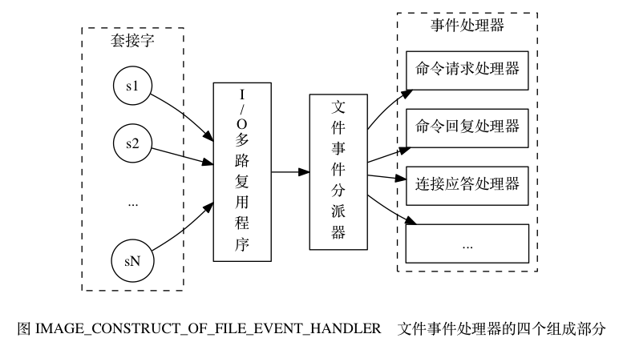

Redis文件事件模型
==

> 该段内容建议直接浏览 http://redisbook.com/preview/event/file_event.html

## 1. 文件事件处理器

### 1.1 简介
Redis 基于 Reactor 模式开发了自己的网络事件处理器： 这个处理器被称为文件事件处理器（file event handler）：

- 文件事件处理器使用 I/O 多路复用（multiplexing）程序来同时监听多个套接字， 并根据套接字目前执行的任务来为套接字关联不同的事件处理器。
- 当被监听的套接字准备好执行连接应答（accept）、读取（read）、写入（write）、关闭（close）等操作时， 与操作相对应的文件事件就会产生， 这时文件事件处理器就会调用套接字之前关联好的事件处理器来处理这些事件。

虽然文件事件处理器以单线程方式运行， 但通过使用 I/O 多路复用程序来监听多个套接字， 
文件事件处理器既实现了高性能的网络通信模型， 又可以很好地与 Redis 服务器中其他同样以单线程方式运行的模块进行对接， 这保持了 Redis 内部单线程设计的简单性。

### 1.2 文件事件处理器的构成

展示了文件事件处理器有四个组成部分， 它们分别是套接字、 I/O 多路复用程序、 文件事件分派器（dispatcher）、 以及事件处理器。

Redis 在 I/O 多路复用程序的实现源码中用 #include 宏定义了相应的规则， 程序会在编译时自动选择系统中性能最高的 I/O 多路复用函数库来作为 Redis 的 I/O 多路复用程序的底层实现：

### 1.3 I/O 多路复用程序的实现

Redis 的 I/O 多路复用程序的所有功能都是通过包装常见的 select 、 epoll 、 evport 和 kqueue 这些 I/O 多路复用函数库来实现的，
每个 I/O 多路复用函数库在 Redis 源码中都对应一个单独的文件， 比如 ae_select.c 、 ae_epoll.c 、 ae_kqueue.c ， 诸如此类。

因为 Redis 为每个 I/O 多路复用函数库都实现了相同的 API ， 所以 I/O 多路复用程序的底层实现是可以互换的。

Redis 在 I/O 多路复用程序的实现源码中用 #include 宏定义了相应的规则， 程序会在编译时自动选择系统中性能最高的 I/O 多路复用函数库来作为 Redis 的 I/O 多路复用程序的底层实现：

### 1.4 事件的类型
I/O 多路复用程序可以监听多个套接字的 ae.h/AE_READABLE 事件和 ae.h/AE_WRITABLE 事件， 这两类事件和套接字操作之间的对应关系如下：
- 当套接字变得可读时（客户端对套接字执行 write 操作，或者执行 close 操作）， 或者有新的可应答（acceptable）套接字出现时（客户端对服务器的监听套接字执行 connect 操作）， 套接字产生 AE_READABLE 事件。
- 当套接字变得可写时（客户端对套接字执行 read 操作）， 套接字产生 AE_WRITABLE 事件。

I/O 多路复用程序允许服务器同时监听套接字的 AE_READABLE 事件和 AE_WRITABLE 事件， 如果一个套接字同时产生了这两种事件， 那么文件事件分派器会优先处理 AE_READABLE 事件， 等到 AE_READABLE 事件处理完之后， 才处理 AE_WRITABLE 事件。

这也就是说， 如果一个套接字又可读又可写的话， 那么服务器将先读套接字， 后写套接字。

### 1.5 API

### 1.6 文件事件的处理器
Redis 为文件事件编写了多个处理器， 这些事件处理器分别用于实现不同的网络通讯需求， 比如说：
- 为了对连接服务器的各个客户端进行应答， 服务器要为监听套接字关联连接应答处理器。
- 为了接收客户端传来的命令请求， 服务器要为客户端套接字关联命令请求处理器。
- 为了向客户端返回命令的执行结果， 服务器要为客户端套接字关联命令回复处理器。
- 当主服务器和从服务器进行复制操作时， 主从服务器都需要关联特别为复制功能编写的复制处理器。
等等。
