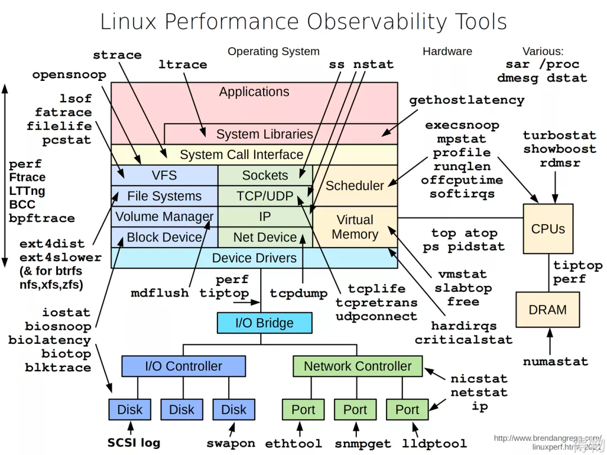

问题排查指南
==

> 来自公众号 得物技术 https://mp.weixin.qq.com/s/mOvtXWVJJDFWkmFpiQvs_A

## 报警排查

### 流程

- 发现问题，第一时间反馈自身已经介入处理
- 80%事故是当日上线的变更，从此处着手排查
- 对于事故，第一时间止损，根据严重程度选择紧急修复、降级、重启、甚至回滚
- 从资源利用率到延迟建立不同SOP，遇到问题按图索骥，可以解决绝大部分问题。如果解决不了，则寻求队友以及更专业人士帮忙处理。

### SOP手册

建立好SOP（标准作业程序）手册，可以提升组织的问题解决效率。有问题可以根据SOP，快速介入问题排查。

大体可以建立如下一些文档：

- 服务调用异常排查SOP
- 响应延迟增长问题排查SOP
- 熔断问题排查SOP
- Mysql响应RT升高排查 SOP
- Redis响应RT升高排查SOP
- ES响应RT、错误率升高SOP
- goroutine异常升高排查SOP
- 实例CPU、内存异常排查SOP
- 流量环比上涨排查SOP
- 业务常见问题排查

处理手册应该做好以下几点： 涵盖各种工具的链接，有服务的Owner，基建的负责人，要做到不靠搜，不靠问。 Grafana 等工具做好 Dashboard ，一个好的 Dashboard 能够直观的定位到有问题的 API ，可以看到 P99,
95, 90 等延迟, QPS、流量等监控。错误率是重点监控的值，延迟只是表象，错误能帮我们接近真相。

查看对应的服务是否存活？是否存在资源瓶颈（CPU 打满等）？Goroutine 是否飙升？全家桶炸了？ 这种就直接重启，大概率是资源连接申请了没有释放。重启无效就止血。

基建（Redis，Mysql 等）的延迟，查看当前的连接数，慢请求数，硬件资源等。性能之巅里的 USE（utilization、saturation、erros）是个很好的切入点，对于所有的资源，查看它的使用率、饱和度和错误。

部分接口慢，直接限流防止雪崩，抓一条请求看看 tracing ，看看链路的耗时。 一个合格的处理手册交给新人也能够定位到问题点，并能解决一部分的问题。

## Go项目性能排查

### 工具

- pprof
- trace
- Goroutine可视化（divan/gotrace）
- perf
- 瑞士军刀

Brendan gregg 大佬绘制了一个性能指南，被称为瑞士军刀。当我们怀疑 OS 问题的时候可以按图使用对应的工具，当然最有效的是喊上运维大佬们来支援

### 优化

做好 benchmark，以直观数字对比作为基准。

#### 应用层

业务逻辑优化可以很明显的解决因设计不合理造成的性能问题
- 资源池化，引入sync.pool
- 锁的收敛，控制使用范围
- JSON库的替换等，内存分配永远是性能杀手

Fasthttp best practices 非常值得我们学习。性能不是一招提升的，要方方面面的抠细节。

#### 系统层

- 尝试升级版本
- 升级硬件

## 演进

- Continuous Profiling、 对pprof等持续采样做分析 Conprof
- eBPF + Go

